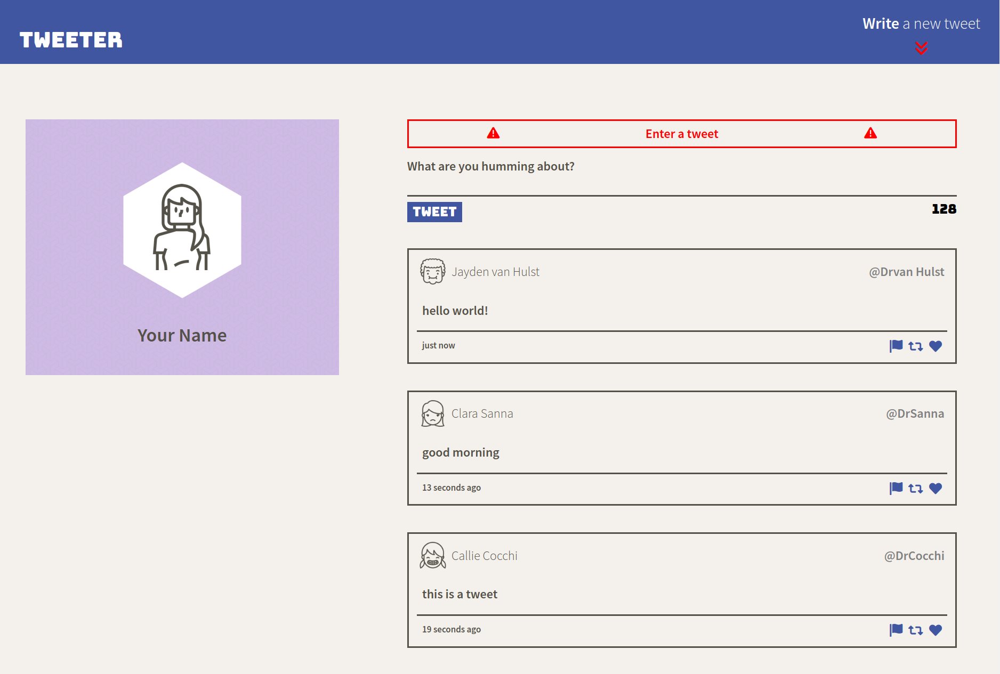

# Tweeter Project

Tweeter is a simple, single-page Twitter clone built upon HTML, CSS, JS, jQuery, AJAX, Node, and Express.

## Screenshots

## Getting Started

1. Clone your repository onto your local device.
2. Install dependencies using the `npm install` command.
3. Start the web server using the `npm run local` command. The app will be served at <http://localhost:8080/>.
4. Go to <http://localhost:8080/> in your browser.

## Dependencies

- Express
- Node 5.10.x or above
